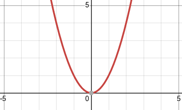
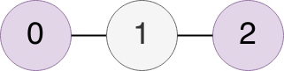
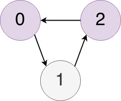

If you want to know how Inciteful works but you think that the graphs we use are something that is plotted on an `xy` plane and look like this:

Then start here.  It's a very basic rundown of what a graph is and how they help us think about the way in which academic papers are connected.  This page only touches on the topics that are relevant to understanding Inciteful.

- [Dots and Lines](#dots-and-lines)
- [Directed Graphs](#directed-graphs)
- [Cycles](#cycles)
- [Next Steps](#next-steps)

# Dots and Lines
The graphs we are dealing with are simply a collection of `nodes` and `edges` where the nodes are connected together (or not) by the edges.  In the context of academic papers, the papers themselves are the nodes and the edges are the citations connecting the nodes.  A simple graph looks like this:

In this graph there are three nodes and two edges:
* nodes - `0`, `1`, and `2`
* edges - `{0,1}` and `{1,2}`

You might notice that something doesn't feel quite right with this graph in the context of academic papers... 

# Directed Graphs
That's because there are different types of graphs.  One way of differentiating between types of graphs is when the edges have some sort of direction implied by their nature. 

These are called directed graphs and in the case of academic papers, the citations have a direction inherent to them.  If paper `a` cites paper `b` that does not mean that paper `b` cites paper `a`.  In fact that is impossible (or at least should be), because paper `a` has to be published after paper `b`.  

# Cycles
The fact that papers cannot cite each other has deeper implications for how we think about the academic graph.  This brings us to the concept of "cycles" in directed graphs.  A cycle is when it is possible to leave one node in a graph, following an edge, and return back to that same node by following other edges.  This graph has a cycle:

But because of the way in which the "publication cycle" (hardy har) works in academia, you should never have a cycle in the graph of academic literature.  

There is a very creative name for this type of graph.  It's called a "Directed Acyclic Graph" or (DAG)

# Next Steps
Now that you are an expert in graphs, head over to the [How Inciteful Works](how-does-it-work.md) page.  