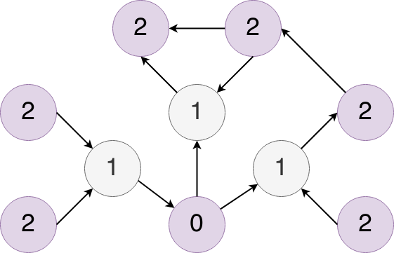
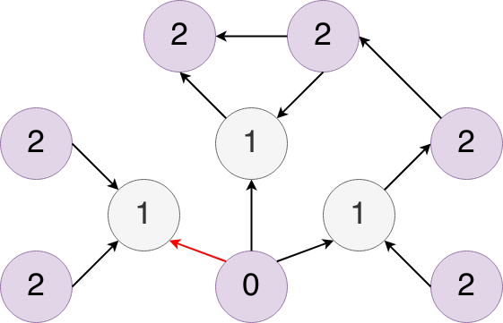
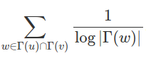
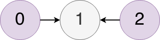
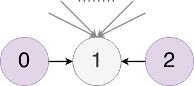
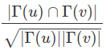

In order to understand how Inciteful works, you should have a base line level of knowledge about graphs.  If you don't, read [Graphs Explained](graphs-explained) first and then come back here. 

- [Academic Papers as Graphs](#academic-papers-as-graphs)
  - [As a Directed Acyclic Graph](#as-a-directed-acyclic-graph)
- [Building Local Graphs](#building-local-graphs)
  - [Starting with a Paper](#starting-with-a-paper)
  - [Making Your Own Graph](#making-your-own-graph)
- [Algorithms](#algorithms)
  - [Importance](#importance)
    - [PageRank](#pagerank)
  - [Similarity](#similarity)
    - [Adamic/Adar](#adamicadar)
    - [Salton Index](#salton-index)
- [Graph Cache & SQL](#graph-cache--sql)
- [The Underlying Data](#the-underlying-data)

# Academic Papers as Graphs
One way to think about the body of academic literature is as one big graph with the papers serving as the nodes and citations serving as the edges connecting the vertices.  When conceptualized as such, you are able to apply an entire area of mathematics, called graph theory, to academic literature.  As it turns out, there are certain classes of problems in graph theory, the solutions to which, are helpful in analyzing the academic graph.  

But before we dive into the [algorithms](#algorithms) we use, let's think a talk a bit more specifically about what type of graph the academic literature forms and how we construct them.

## As a Directed Acyclic Graph
If you think about how academic literature evolves the underlying structure of the graph becomes apparent and it has implications for what types of algorithms we can use as well as the real world meaning of the results.  The two most important factors are:

* Citations are a one way relation.  `Paper A` citing `Paper B` does not mean that `Paper B` also cites `Paper A`.  As a result, the graph is what we call "[directed](graphs-explained#directed-vs-undirected)".
* Academic literature is inherently subject to time, i.e. papers can only cite what has already been published.  As a result, there is no way for loops to form in the graph. 

These two points, happen to satisfy the requirements for calling the academic graph a **directed acyclic graph** or (DAG) [[wikipedia]](https://en.wikipedia.org/wiki/Directed_acyclic_graph).  Understanding this, helps us to understand how to interpret the results and implications of our later analysis. 

# Building Local Graphs
The entire graph of academic literature is too big to efficiently analyze as one giant graph. Additionally a lot of information in the graph is totally irrelevant to the topic you want to learn about.  As a result, we try to make a localized graph specific to your query.  The normal starting point is with a single paper but the goal is to create a custom graph centered around the topic of your choice but the real power lies in making your own graph. In order to take full advantage of this it helps to understand the underlying structure of the graphs which are created for you. 

## Starting with a Paper
When you start with a paper (we call it the `seed paper`), Inciteful builds a network around the `seed paper` by finding all of the papers which that papers cites and which cite that paper.  The we do it again with all of those papers we found in the first search.  The resulting graph looks similar to this: 

Where the node labeled `0` represents the `seed paper`, the nodes labeled `1` represent the results of the first search, and the nodes labeled `2` represent the results of the second search.  In this process we also capture all of the citations between the nodes in level two as well.  From here we run a few different algorithms against this graph to find the most interesting papers. 

Typically these depth-2 localized graphs span about 10-20,000 papers and 50-100,000 citations.  But for papers that have a lot of citations these graphs can grow pretty large.  Some can have over 1,000,000 papers and 2-3,000,000 citations. These large graphs pose a few problems, first it takes a long time to construct and analyze them (on the order of 3-4 minutes) and second, the resulting graph is just too large to provide useful results on your specific topic.  

As a result, if a depth-2 graph will contain over 150,000 papers we stop after the first search and encourage you use the keyword filter to find papers relevant to your query to make the graph more tailored to your search. 

## Making Your Own Graph
The core idea of Inciteful is to enable you to make your own personalized graph.  So as you find papers that are interesting, you can start to add them to the graph to make it more centered around your topic.  When you have more than one paper building the graph, we consider these the `seed papers`

Behind the scenes this is accomplished by "faking" the graph.  Essentially when you add multiple papers to a graph Inciteful creates a fake node that acts as if it cites the papers you added to the graph.  

What that means for the graph we just saw is that node `0` isn't an actual paper and there would be no citations coming into that node, because no one cites a fake paper... and so we flipped that citations and made it red.  The `seed papers` are the nodes labeled `1` and the nodes labeled `2` are all of the papers which are cited by or cite the `seed papers`.

Also, all of the algorithms we run that predict things like similarity are relative to this "fake" node `0`.   It's helpful to understand this structure as you are trying to filter the graphs based on depth or interpreting the results of different algorithms. 

# Algorithms
Now that we have built our localized graph around your `seed paper(s)` we move onto the analysis part of the process.  Currently we use a few different algorithms and are looking to expand them as we see future use cases.  Right now the two types of algorithms we run are centered around paper "Importance" in the graph and "Similarity" to the `seed paper`.  The real world implications for each, when applied to the academic graph, are pretty interesting. 

## Importance 
"Importance" is pretty much exactly what it sounds like.  How important is the paper to the graph.  There are a number of ways in which to measure it from simply counting the number of incoming edges (number of citations) to more nuanced algorithms like centrality and PageRank.  We chose to use PageRank because it can be computed quickly while doing a good job of highlighting the "Important" papers.  We'll talk more about PageRank in a second but first let's talk about the types of papers "Importance" metrics tend to highlight. 

At their core, regardless of what metric you use, "Importance" centers around the number of citations a paper has.  But given how academia works, papers tend to take a long time to accrue citations. Therefore the "Important" papers in a graph are always going to be the older papers who have had time to accrue the needed citations.  So the "Important Papers" tables are going to be a good place to start when trying to understand the foundations of a topic and where it came from. 

### PageRank
We chose to use PageRank as our importance metric.  I won't go in depth about the PageRank algorithm itself, as that as [been](https://blog.majestic.com/company/understanding-googles-algorithm-how-pagerank-works/) - [done](https://www2.cs.duke.edu/csed/principles/pagerank/) - [innumerable](https://cs.wmich.edu/gupta/teaching/cs3310/lectureNotes_cs3310/Pagerank%20Explained%20Correctly%20with%20Examples_www.cs.princeton.edu_~chazelle_courses_BIB_pagerank.pdf) -  [times](https://www.youtube.com/watch?v=P8Kt6Abq_rM). 

But at it's core PageRank doesn't just count the number of citations you get, it tries to score you based on the importance of the papers making those citations.  For those of you closely following, you may notice that the description I just gave is a bit circular.  In order to judge importance of a node you need to know the importance of the node giving the citation... But how do you get the importance of that node?  Just suffice to say that in order to calculate PageRank, you need to cycle through the graph a few times, each time updating importance, in order to calculate it.  

Anyways, the power of PageRank is that it also surfaces papers which may not have a ton of citations but that are cited by papers which do.  In real world terms this means that it tends to show not just the most recent influential papers in a topic, but also the papers that influenced those papers.  Giving you better incite (pun intended) into the history of a topic than if you just looked at the top cited papers. 

If you choose, you can always sort by the most citations using our [SQL query panel](power-users#sql-query-panel) but we find that PageRank does a great job highlighting the best papers. 

## Similarity
The next major problem we try to tackle is similarity.  The class of algorithms we chose to use here are often called "Link Prediction" algorithms as well.  They are often used in social networks for "friend recommendations".  

The general thinking goes like this.  If you are friends with a lot of my friends maybe we should be friends.  For papers, if paper `a` cites a lot of the papers which paper `b` cites, maybe they should be friends ([bibliographic coupleing](https://en.wikipedia.org/wiki/Bibliographic_coupling)).  Or if paper `a` is cited by a lot by papers which also cite paper `b`, then maybe they should be friends ([co-citation](https://en.wikipedia.org/wiki/Co-citation)).

There are a few complications:  

1) What if paper `a` cites 500 papers and paper `b` cites 3, should they really be friends?
2) What if the papers that they each cite are all cited by 10,000 people?  Is that really a "close" connection?
3) What if paper `b` has only one citation, should it really be friends with all the other papers that the citing paper references? 
4) What is paper `a` and `b` both have 1000's of citations and share 20?  Should those be better friends that two papers which have 10 citations but share 5? 

Most similarity algorithms try to compensate for one of these two problems. 

For the close reader you might be thinking, for the Inciteful graphs, what exactly are papers in the graph "similar" to?  Glad you asked.  Similarity means two different things depending on the type of graph we are using.  If your graph is centered around a single paper, then similarity is calculated relative to that paper.  But if you have seeded your graph with multiple papers, then the similarity is calculated relative to the "fake paper" [we talked about earlier](#making-your-own-graph). 

Like the importance scores, similarity scores have an interesting real-world implication.  Since citations to papers are built over time, papers published after the `seed paper` have a better chance at citing the same papers.  So similarity metrics tend to bias towards more recent publications that are building on the important papers.  As you add papers to your custom graph from the "Similarity Table", you increasingly bias the next graph's similarity scores to more and more recent papers.  As a result you end up quickly zeroing on the the latest research in your topic.

### Adamic/Adar
We've chosen to use the Adamic/Adar algorithm for our bibliographic coupling metric. This tries to compensate for the problem 2, where the mutual friend has a ton of friends.  The equation is as follows:

Put into words a normal person can understand, for every paper that `a` and `b` mutually cite, the similarity score between the two is calculated as the sum of the inverse log of the number citations the mutually cited paper receives.  Ok, that was only slightly clearer, but let me try again but this time with a simple example.  Say we have a simple graph:

In this case the similarity score between papers `0` and `2` would be `1/log(2) = 3.322` because paper `1` has two nodes citing it (hence the `log(2)`).  If nodes `0` and `2` had a bunch of other mutual citations, then we would repeat the process for each mutual citation and the score would be the sum of those individual scores.  

One last example, in this case we have another simple graph except this time paper `1` has 100 citations.  

So the similarity score between papers `0` and `2` would be `1/log(100) = 0.1`, clearly lower than the previous example. 

We've chosen the Adamic/Adar algorithm because it doesn't overly penalize a mutual paper for being popular but it still rewards papers which mutually cite less cited papers.  That tends to be more indicative of sharing a niche. 

### Salton Index
For the co-citation metric we are using the [Salton Index](https://cran.r-project.org/web/packages/linkprediction/vignettes/proxfun.html#salton-index-cosine-similarity).  This algorithm tries to compensate for problems 3 and 4.  The equation is as follows:

Where `Γ(u)` means the papers citing `u` and `Γ(v)` means the papers citing `v`.  The square root of the product of the two citation counts in the denominator helps to even out the problem that arises when there is a disparity between the number of citations each paper has received. This in turns helps to address problems 3 and 4 from above. 

# Graph Cache & SQL
The last step in the process is caching the output of the previous steps in order to avoid repeating the work.  The output is cached for a period of time (24+ hours) so that when you return to the page, it should feel a lot faster than when it was first loaded.  This intermediate format has a SQL interface over the top of it and all results you see rendered on the page are extracted through that interface.  As a result, on the bottom of any table you wish to dig into, you can click the  button to see the underlying query and modify it to your needs. 

You can explore the SQL schema from the [Power Users](power-users#sql-query-panel) section. 

# The Underlying Data
None of this would have been possible without the incredible effort that went into organizing and categorizing all the academic literature into a structured format.  We use data or took inspiration from the following places:

- [Microsoft Academic Graph](https://www.microsoft.com/en-us/research/project/microsoft-academic-graph/): MAG is currently the basis for all of the underlying data used to construct the graphs.   

- [Semantic Scholar](https://www.semanticscholar.org/): The source of all the abstracts rendered on the site. 

- [Unpaywall](https://www.unpaywall.org/): The source for all the Open Access links. 

- [Crossrefs](https://www.crossref.org/): They were the original source for all the non-citation paper metadata. 

- [Open Citations](https://www.opencitations.net/): The original source of all of the citation data. 