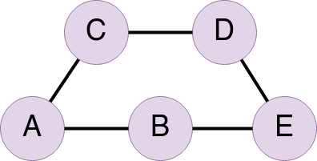
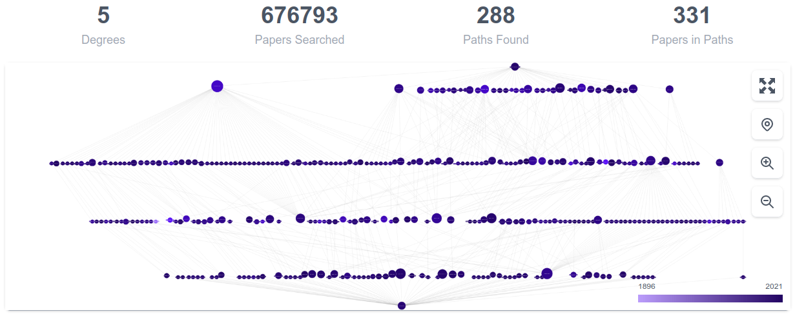
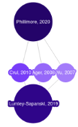
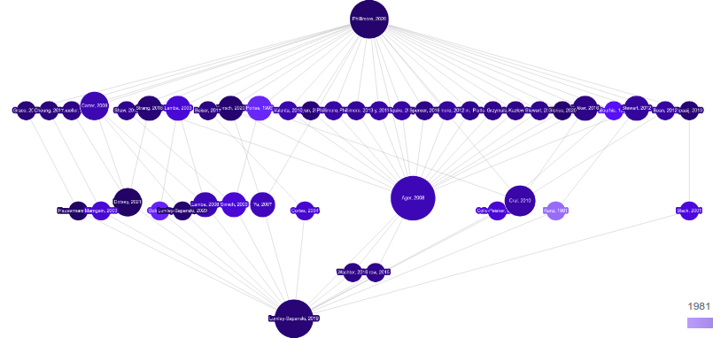
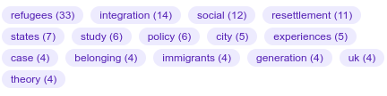

In order to understand how the Literature Connector works, you should have a base line level of knowledge about graphs.  If you don't, read the [Graphs Explained](graphs-explained) page and the [Academic Papers as Graphs](paper-disovery-explained#academic-papers-as-graphs) section then come back here. 

- [What is it?](#what-is-it)
- [Why Build the Literature Connector?](#why-build-the-literature-connector)
- [Searching the Academic Graph](#searching-the-academic-graph)
- [Paths in a Graph](#paths-in-a-graph)
  - [Shortest Path](#shortest-path)
- [Creating the Output](#creating-the-output)
- [Extended Graphs](#extended-graphs)
- [Next Steps](#next-steps)

# What is it?
The Literature Connector is a tool that attempts to connect two academic papers together using citations as the links between papers.  It then highlights the paths it found between those papers and allows you to explore, filter, and dive deeper into the papers found along the paths.

# Why Build the Literature Connector?
The idea of using citations to connect literature together isn't a new one.  But it's importance became apparent after reading
[Range](https://www.goodreads.com/book/show/41795733-range){:target="_blank"}, a book about the importance of people whose knowledge spans multiple domains and their ability to make connections between disparate ideas that more specialized people don't see. 

There are a number tools out there that solve this.  The problem with these tools is that they are only able to do a search one or two levels deep in the graph.  With the fast database we built for the Paper Discovery tool. We thought we could do deeper searches faster than the other tools and we were right. I'm happy to say that I've yet to find two papers with citation data that couldn't be connected with our tool.  

So this tool is for interdisciplinary scholars or those moving into a new research area who are curious how their new domain connects to their old one. 

# Searching the Academic Graph
Unlike with the Paper Discovery tool, we don't build a "local graph".  The entire universe of academic literature is our graph. Our problem this time around is how to find a path, via incoming and outgoing citations, from one paper to another.  While the normal graph of academic literature is a [directed acyclic graph](graphs-graphs-explained#directed-graphs) for our purposes we ignore the directed nature of the citation and just treat a citation as an undirected edge between the two nodes.  

# Paths in a Graph
An important concept that has yet to be covered is the idea of a "path".  For our purposes we'll define a path as a ordered list of nodes which are adjacent to one another. Let's unpack that really quick.  First, for two nodes to be "adjacent" they need to be connected to one another by an edge (or in this case a citation).  Second, it's an "ordered" list, which means order is important where the first node is the list is where you are leaving from and the last node in the list is where you are going to. 

Let's use the following graph with nodes `A`, `B`, `C`, `D` and `E` for example.  

There are two possible paths from node `A` to node `E`.  The first being [`A`, `B`, `E`] and the second being [`A`, `C`, `D`, `E`].  This is a pretty simple example but the number of possible paths gets a bit crazy when you are dealing with a strongly connected graph (i.e. there are a lot of links between nodes) like we are. 

For our purposes we do away with a lot of complexity by just focusing on finding the shortest paths between two nodes, with some exceptions as you will see.

## Shortest Path
The concept of what is the shortest path is can get pretty complex if you are dealing with weighted edges (which I won't go into now), but since we are treating our graph as an unweighted graph, it simplifies the calculation a lot. This means, that for us, the shortest path is the path that gets you from your initial node to your destination node in as few hops as possible.  In the above example the shortest path from `A` to `E` was [`A`, `B`, `E`].  Also, in many unweighted graphs and in most of the graphs created by the Literature Connector, there are multiple shortest paths.  

There are a number of ways to find the shortest paths but the one we use is called a [bidirectional search](https://en.wikipedia.org/wiki/Bidirectional_search).  Using this method we initiate two simultaneous searches, one from from our source node and one from our destination node.  In each iteration of the search we:

1) Expand the search out to include papers which are one level deeper in the graph
2) Compare the two search results to see if the two search results have overlapping nodes.  
   - If not, we run another iteration
   - If so, we know that the shortest paths from source to destination will run through the overlapping nodes. 

Once we have two networks that meet in the middle, we can join them together and determine the shortest paths on this much smaller network.  It helps to greatly reduce the complexity of the calculations. 

# Creating the Output
Once we have our list of "shortest paths", we then create a new graph consisting of just the citations and papers which are present in the shortest paths.  These edges are are directed, flowing from our source node to our destination node, regardless of their true direction in the literature.  This makes the algorithm we use for laying out the diagram happier and makes for a more clear flow.  Here is an example of one of the more complex graphs (which is so large as the papers so many hops away from one another as to be useless, but it's still pretty):

# Extended Graphs
Often times when you are connecting two close papers the graph won't be that interesting.  The papers might be directly connected or are connected by just a few other papers.  As in this example: 

So while it's interesting to see the three papers they have in common, you get more interesting results if you extend the paths by an extra level.  So in this case that means including all paths of three hops in addition to the paths of two hops.  The end result gives you a better overview of how these papers are interrelated:

Additionally things like the keyword cloud are better populated to give more context:

# Next Steps
To learn more about the functionality of the Literature Connector, head back over to the [Quick Start](quick-start#literature-connector) page.