The real power behind Inciteful is it's ability to craft a graph based on your specific topic.  There are a variety of ways in which to do that, which you can view on on the [use cases](use-cases) page but here we will just go through a simple search process which you can follow along with or do your own search in parallel.  

- [1) Start with a Paper](#1-start-with-a-paper)
- [2) Explore the Results](#2-explore-the-results)
  - [Important Papers](#important-papers)
  - [Similar Papers](#similar-papers)
  - [Other Data](#other-data)
  - [Filters](#filters)
- [3) Add Relevant Papers](#3-add-relevant-papers)
- [4) Create the Next Graph](#4-create-the-next-graph)
- [5) Repeat Steps 3 and 4](#5-repeat-steps-3-and-4)
- [6) Review the Results](#6-review-the-results)
- [7) Download Your Papers](#7-download-your-papers)
- [Next Steps](#next-steps)

# 1) Start with a Paper
The easiest way to get started is by having a paper that covers a topic in which you are interested.  You can either use the search box to type in the title or enter the [DOI](faq#what-is-a-doi) of the paper if you can't find it through the search.  For this example we will attempt to find the latest papers about methods of measuring segregation.  We will use the following as the `seed paper` but you can use whatever you'd like:

[“Planning Dissonance” and the Bases for Stably Diverse Neighborhoods: The Case of South Seattle](https://inciteful.xyz/p/10.1111/cico.12224){:target="_blank"}

# 2) Explore the Results
At the top of the page we have information about the `seed paper` such as the title, authors, journal it was published in, etc.  If they are available we also include links to the open access version of the article as well as the abstract.  In addition to those we have basic stats about how many papers are citing this paper, how many papers the `seed paper` cites, an open access link if applicable, as well as some information about the graph.  

    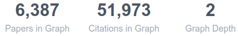

In this instance, it is a depth 2 graph, with 6,387 papers and 51,973 citations.  To better understand what this means in the context of Inciteful head over to [Graphs Explained](graphs-explained). 

## Important Papers
We'll skip past the `Filters` section and head down to the tables.  The first table covers the `Most Important` papers, as measured by the [PageRank](graphs-explained#what-is-page-rank) algorithm.  PageRank goes beyond simple citation counts and it values papers which are cited by other important papers, so you don't need to have a lot of citations to be important, just be cited by important papers. 

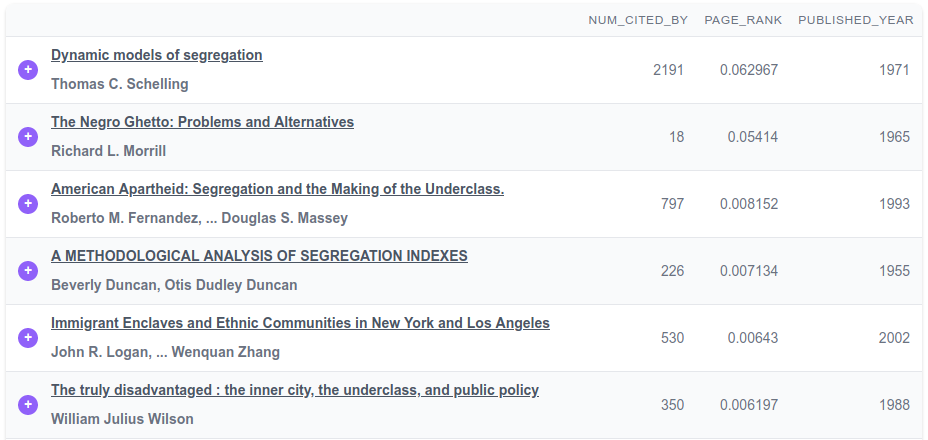

Given the nature of academic literature and how it takes time to build up citations, these papers tend to be the older papers in the graph.  They typically represent the seminal papers in the field.  

You can also click on any of the paper titles to get more information about them, similar to what is presented at the top of the current page. 

## Similar Papers
This section uses a [link prediction algorithm](graphs-explained#link-prediction-algorithms) to show you the most similar papers based on who these papers cite.  If the `seed paper` cites many of the same papers that another paper does, then they are considered similar. 

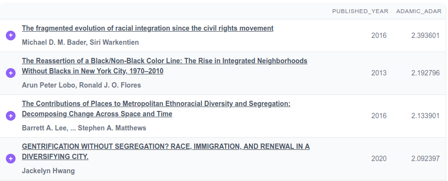

The effect of similar papers is the inverse of important papers.  Since papers which are published after the `seed paper` have a better chance of citing the same papers, these papers tend to be more recent papers in the field.

## Other Data
Under the `Similar Papers` section we have the `Other Data` section.  This section is used to highlight other interesting information about the graph.  Such as most important authors, institutions, and journals.  It helps to get an idea of where the work in this space is being done, by whom, and in what journals. 

## Filters
Coming back to the `Filter` section, you can use these fields to filter the papers in the tables we just reviewed.  You can filter by keyword (view an in depth explanation of the [query syntax](power-users#graph-keyword-filters)), distance, and year.  These are especially helpful to zero in on the types papers you are looking for when the current graph is large. 

As you can see from the above image in the `Important Papers` section the most important papers is titled `Dynamic models of segregation`, so lets use that as a lead and enter `segregation models` in our keyword filter.  This gives us the following in our `Important Papers` table:

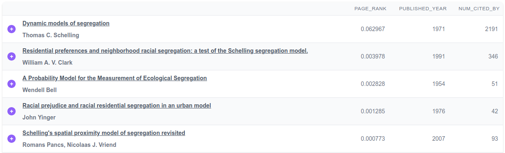

And in the `Similar Papers` table:
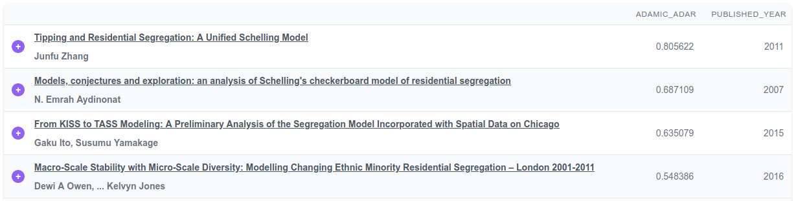

# 3) Add Relevant Papers
Now that we have a list of papers that are relevant to what we are looking for, we want to start making a new graph centered around these papers.  In order to do so, we want to click the  next to each title.  This will start collecting papers to add to the graph.  

To ensure good results, it is best to add at least five papers which cover your specific topic.  Also, be sure to use the paging at the bottom of each table to dig in past the first page.

# 4) Create the Next Graph
As you add papers a button will pop up on the bottom-right of the screen: 

Once you are done adding the papers you are interested in click that button to create a new graph centered around the papers you have chosen.  This new graph should be more focused on your topic than your previous one. 

In our example we added 7 more papers to the graph.  If you are following along, view the [updated graph](https://inciteful.xyz/p?dois[]=10.1006%2Faama.2001.0722&dois[]=10.1007%2F978-0-387-47681-0_12&dois[]=10.1017%2Fs1468109915000304&dois[]=10.1080%2F00222500490480202&dois[]=10.1080%2F0022250x.1971.9989794&dois[]=10.1111%2Fcico.12224&dois[]=10.1111%2Fj.1467-9787.2010.00671.x&dois[]=10.2139%2Fssrn.375080&maxDistance=2&minDistance=1){:target="_blank"} here.  

Our new graph uses the following as seed papers:

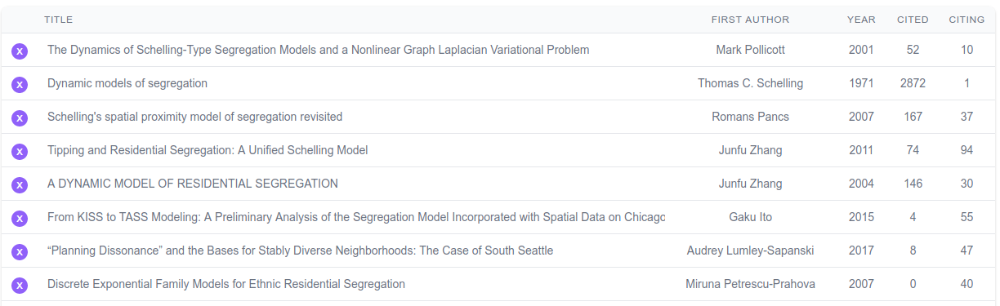

# 5) Repeat Steps 3 and 4
Now that we have built our new graph, we want to take a look at the `Similar Papers` table again.  For us it looks like this and is much more targeted to what we are looking for: 

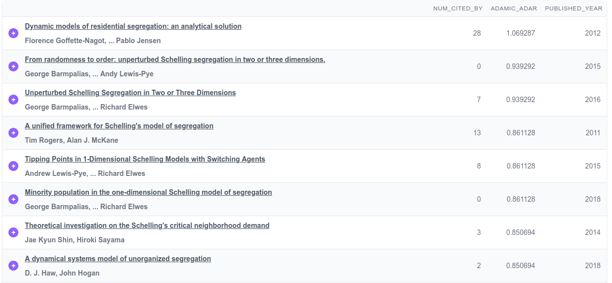

So let's add a few more papers that look interesting.  The top papers tend to focus on the "Schelling Model", which makes sense because we started with that paper, but we also want to make sure we capture other ideas by looking beyond the first page of the table.  

Our [next graph](https://inciteful.xyz/p?dois[]=10.1006%2Faama.2001.0722&dois[]=10.1007%2F978-0-387-47681-0_12&dois[]=10.1007%2Fs00182-015-0526-2&dois[]=10.1007%2Fs00440-019-00918-0&dois[]=10.1007%2Fs00521-019-04199-5&dois[]=10.1007%2Fs10955-016-1589-6&dois[]=10.1016%2Fj.jpubeco.2011.08.011&dois[]=10.1017%2Fs1468109915000304&dois[]=10.1068%2Fb37068&dois[]=10.1080%2F00222500490480202&dois[]=10.1080%2F0022250x.1971.9989794&dois[]=10.1080%2F0022250x.2018.1427091&dois[]=10.1088%2F1742-5468%2F2011%2F07%2Fp07006&dois[]=10.1111%2Fcico.12224&dois[]=10.1111%2Fj.1467-9787.2010.00671.x&dois[]=10.1155%2F2007%2F48589&dois[]=10.1177%2F0049124109334792&dois[]=10.2139%2Fssrn.1436978&dois[]=10.2139%2Fssrn.375080&maxDistance=2&minDistance=1){:target="_blank"} added eleven more papers and as you can see the subsequent `Similar Papers` table starts to focus on the newer literature:

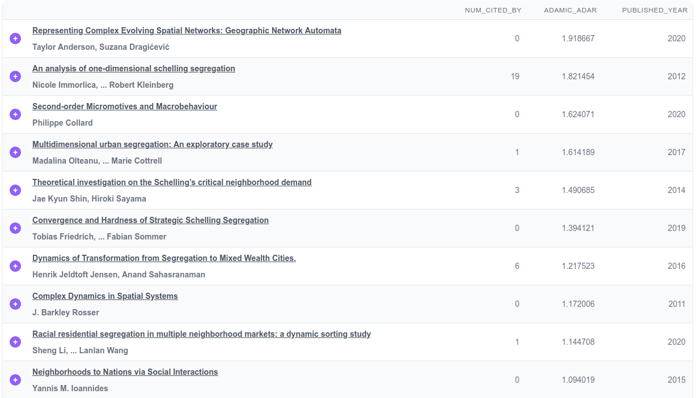

We'll add a few more interesting papers and then call it a day.  Often people find themselves with 20-40 different papers.

# 6) Review the Results
We've stopped with [this graph](https://inciteful.xyz/p?dois[]=10.1006%2Faama.2001.0722&dois[]=10.1007%2F978-0-387-47681-0_12&dois[]=10.1007%2F978-3-030-35389-6_12&dois[]=10.1007%2Fs00182-015-0526-2&dois[]=10.1007%2Fs00440-019-00918-0&dois[]=10.1007%2Fs00521-019-04199-5&dois[]=10.1007%2Fs10955-016-1589-6&dois[]=10.1007%2Fs42001-020-00062-z&dois[]=10.1016%2Fj.jpubeco.2011.08.011&dois[]=10.1017%2Fs1468109915000304&dois[]=10.1068%2Fb37068&dois[]=10.1080%2F00222500490480202&dois[]=10.1080%2F0022250x.1971.9989794&dois[]=10.1080%2F0022250x.2018.1427091&dois[]=10.1080%2F0022250x.2019.1695608&dois[]=10.1088%2F1742-5468%2F2011%2F07%2Fp07006&dois[]=10.1103%2Fphysreve.102.012317&dois[]=10.1111%2Fcico.12224&dois[]=10.1111%2Fj.1467-9787.2010.00671.x&dois[]=10.1111%2Fjors.12442&dois[]=10.1155%2F2007%2F48589&dois[]=10.1177%2F0049124109334792&dois[]=10.2139%2Fssrn.1436978&dois[]=10.2139%2Fssrn.375080&dois[]=10.3390%2Fijgi9040270&maxDistance=2&minDistance=1&minYear=2015){:target="_blank"} and now we can see what it has to tell us.  To start, let's focus in on the latest papers published in the space by filtering to only [papers published after 2015](https://inciteful.xyz/p?dois[]=10.1006%2Faama.2001.0722&dois[]=10.1007%2F978-0-387-47681-0_12&dois[]=10.1007%2F978-3-030-35389-6_12&dois[]=10.1007%2Fs00182-015-0526-2&dois[]=10.1007%2Fs00440-019-00918-0&dois[]=10.1007%2Fs00521-019-04199-5&dois[]=10.1007%2Fs10955-016-1589-6&dois[]=10.1007%2Fs42001-020-00062-z&dois[]=10.1016%2Fj.jpubeco.2011.08.011&dois[]=10.1017%2Fs1468109915000304&dois[]=10.1068%2Fb37068&dois[]=10.1080%2F00222500490480202&dois[]=10.1080%2F0022250x.1971.9989794&dois[]=10.1080%2F0022250x.2018.1427091&dois[]=10.1080%2F0022250x.2019.1695608&dois[]=10.1088%2F1742-5468%2F2011%2F07%2Fp07006&dois[]=10.1103%2Fphysreve.102.012317&dois[]=10.1111%2Fcico.12224&dois[]=10.1111%2Fj.1467-9787.2010.00671.x&dois[]=10.1111%2Fjors.12442&dois[]=10.1155%2F2007%2F48589&dois[]=10.1177%2F0049124109334792&dois[]=10.2139%2Fssrn.1436978&dois[]=10.2139%2Fssrn.375080&dois[]=10.3390%2Fijgi9040270&maxDistance=2&minDistance=1&minYear=2015){:target="_blank"}. 

Next we can jump down to the `Other Data` section to see who is publishing, where they work, and where they are publishing.

It's easy to see the top authors:

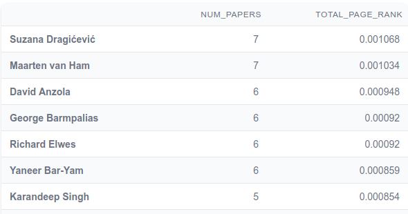

Where they work:

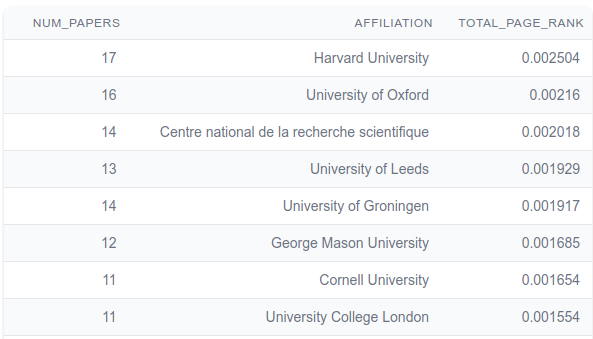

And where they are publishing:

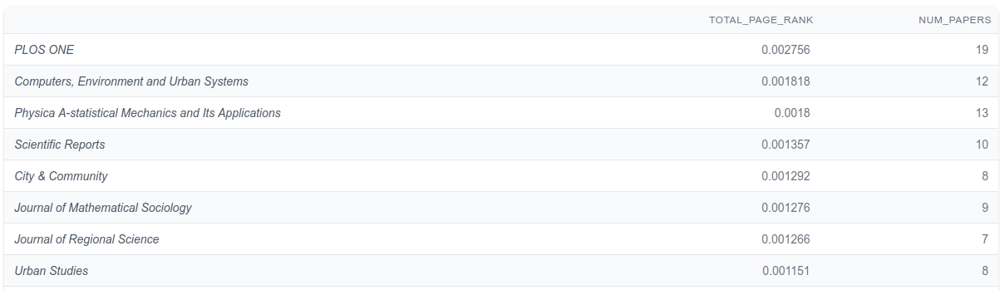

# 7) Download Your Papers
Now that we have found the papers in which we are most interested, we can easily download the results in a [BibTeX](faq#what-is-a-bibtex-file) format by clicking the link that looks like this  at the bottom of the table.  From there you can import it into your reference management tool of choice like Zotero or Mendeley.  

# Next Steps
I hope you found this useful.  If you want more you can head over to the [Use Cases](use-cases) section of the docs to see other ways to use Inciteful.  If you are wondering about how the site works, head over [here](how-does-it-work.md).